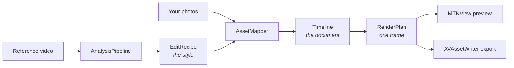

<div align="center">

# Reframe

**Give it a Reel you like. Give it your photos. Get back *your* Reel, cut like the reference.**

[](https://github.com/the-sasi/reframe-video-creator/actions/workflows/ci.yml)


</div>

---

Reframe watches a reference video and extracts its **editing structure** — pacing, cuts, camera
moves, transitions, text rhythm, beat alignment — into a reusable, human-editable document. Then
it rebuilds that structure using your own photos, videos and words.

It does not copy the reference. It copies the *edit*.

```
   Reference reel                  Your content                    Output
   ─────────────────               ─────────────────               ─────────────────
   12 scenes                       10 bouquet photos               12 scenes
   1.02s median cut        +       "Blush Rose Elegance"    =      1.02s median cut
   128 BPM, cut on beat            "DM TO ORDER"                   128 BPM, cut on beat
   7 camera moves                  your logo                       7 camera moves
   4 text layers                                                   your photos, your words
```

## Why this exists

Every "AI video editor" wants a subscription and a round trip to somebody's GPU. This one has
**no API keys, no accounts, no subscriptions, and no network access at all** — the engine
literally contains no `URLSession`, and there's a test that fails the build if one appears.

Everything runs on the phone: Vision for OCR and saliency, Accelerate for the DSP, Metal for
compositing, VideoToolbox for encoding. All of it already installed on the device you own.

## Features

**Reference analysis** — all on-device, all offline
- Shot-boundary detection (adaptive HSV content differencing)
- Dissolve and fade classification via a linear-blend residual test
- Camera-move recovery — push, pull, pan, rotate — by fitting a similarity transform to an optical-flow field
- Text layer extraction with OCR, position, colour and animation inference
- Deterministic BPM and beat-grid detection (spectral flux → autocorrelation → comb-filter phase)
- Dominant-colour palette and shot-scale classification

**Honest inference**
- Every inferred property carries a confidence *and* a plain-language explanation
- Anything under 80% is badged **Guessed** — tap it to see the actual reasoning
- Low confidence degrades to a declared safe fallback instead of guessing loudly
- Fonts are *categorised*, never identified, because that's what's knowable from a 1080p frame

**Intelligent asset mapping**
- Vision saliency, aesthetics scoring and built-in screenshot rejection
- Optimal slot assignment via the Hungarian algorithm — not greedy
- Adjacency-diversity refinement so near-identical photos don't land back to back
- Every choice shows its reason and is one tap from being overridden

**Editing & export**
- Full timeline: trim, split, duplicate, reorder, transitions, text, audio
- Unlimited undo/redo that survives a force-quit
- Beat-snapping timeline with haptics
- 720p / 1080p / 4K, 24/30/60fps, H.264 or HEVC
- **No watermark. Ever.**

## The core idea

Three models, each with exactly one job:



| Model | Role | Property that matters |
|---|---|---|
| **`EditRecipe`** | The *style* | Asset-free by construction — no field can hold a file path, so it's reusable across projects |
| **`Timeline`** | The *document* | Codable value type; the only thing the editor mutates, and only via undoable commands |
| **`RenderPlan`** | One *frame* | Pure function of `(Timeline, time)` — testable with no GPU, no simulator, no device |

The last one is the load-bearing decision. Preview and export call the **same two functions**:

```swift
func plan(_ timeline: Timeline, at time: Double) -> RenderPlan   // pure
func render(_ plan: RenderPlan, into texture: MTLTexture)        // no policy, just draws
```

A display link drives one; an `AVAssetWriter` pull loop drives the other. They differ only in
where source pixels come from. Preview/export divergence isn't a bug to guard against — it's
unrepresentable.

## Status

Authored on Windows, so the Apple-framework half has never met a compiler. Verified so far with
Swift 6.3.3:

| Component | Lines | State |
|---|---|---|
| `RecipeCore` — schema, timeline, 24 undoable commands, binder | ~2,400 | ✅ **Compiles clean** |
| `MediaIO` — frame streaming, audio decode, project store | ~1,300 | ⬜ Needs macOS (AVFoundation) |
| `Analysis` — scene, motion, text, colour, audio | ~3,200 | ⬜ Needs macOS (Vision, Accelerate) |
| `Mapping` — features, cost matrix, Hungarian solver | ~800 | ⬜ Needs macOS (Vision) |
| `Rendering` — Metal graph, text rasteriser, exporter | ~2,400 | ⬜ Needs macOS (Metal, Core Text) |
| App — SwiftUI screens, timeline, `Shaders.metal` | ~2,400 | ⬜ Needs Xcode 26 |

CI covers the rest: [`.github/workflows/ci.yml`](.github/workflows/ci.yml) builds everything on a
`macos-26` runner, unsigned, so no certificate is required.

Two real bugs have already been caught this way — a `swift-tools-version` too low for
`.iOS(.v26)`, and a `resources:` declaration pointing at a directory that doesn't exist. Both
would have failed identically on a Mac.

## Getting started

**Requires macOS 15.5+ and Xcode 26.** A physical iPhone is strongly recommended — Vision's
saliency and aesthetics requests, and the whole Neural Engine path, are slow or unavailable in
the Simulator.

```bash
git clone git@github.com:the-sasi/reframe-video-creator.git && cd reframe-video-creator
open Reframe.xcodeproj        # set your signing team on the Reframe target, then ⌘R
```

If Xcode rejects the checked-in project file (it was hand-authored and no Xcode has opened it):

```bash
brew install xcodegen && xcodegen generate && open Reframe.xcodeproj
```

Engine tests — no simulator, no device:

```bash
cd Packages/ReframeKit && swift test
```

<details>
<summary><b>Building the pure-Swift half on Windows</b></summary>

`RecipeCore` has no Apple-framework dependencies and compiles with the Windows toolchain, which
gives a ~5-second iteration loop on the densest logic. You need Visual Studio with MSVC (Swift
shells out to `link.exe`) and the Swift toolchain:

```powershell
winget install --id Microsoft.VisualStudio.2022.Community --exact --force --custom `
  "--add Microsoft.VisualStudio.Component.Windows11SDK.22621 --add Microsoft.VisualStudio.Component.VC.Tools.x86.x64"
winget install --id Swift.Toolchain -e
```

Then, from a Developer PowerShell (so `link.exe` is on PATH), with `SDKROOT` pointing at the
Windows platform SDK:

```powershell
$env:SDKROOT = "$env:LOCALAPPDATA\Programs\Swift\Platforms\6.3.3\Windows.platform\Developer\SDKs\Windows.sdk"
swift build --package-path Packages/ReframeKit --target RecipeCore
```

</details>

## Using it

1. **Create From Reference** → pick a video from Photos or Files
2. Watch the analysis land — scene count, pacing, camera moves, text slots, BPM. Anything
   uncertain is labelled *Guessed*, not hidden
3. **Use This Style** → add 5–20 photos, a product name, a CTA
4. **Auto Arrange** assigns photos to slots; every assignment shows its reason and is swappable
5. **Generate**, then edit if you want — full timeline, unlimited undo
6. **Export** to Photos

Five taps from opening the app to a rendered reel. The editor is an escape hatch, not a step.

## Project layout

```
reframe/
├── docs/                        Decision record — read 00 first
├── .github/workflows/ci.yml     macos-26 build, unsigned
├── Reframe.xcodeproj/           Xcode 26 project (synchronized folders)
├── project.yml                  XcodeGen fallback
├── Reframe/                     App target — SwiftUI, no engine logic
│   ├── App/  DesignSystem/  Features/  Rendering/  Resources/
└── Packages/ReframeKit/         Engine — pure Swift, no UI framework
    └── Sources/
        ├── RecipeCore/          Schema, timeline, commands, binding
        ├── MediaIO/             Frame streaming, audio, project store
        ├── Analysis/            Reference → recipe
        ├── Mapping/             Feature extraction + optimal assignment
        ├── Rendering/           Metal graph, exporter, preview
        └── Intelligence/        Optional provider (heuristic by default)
```

The module split is compiler-enforced, not conventional: `Analysis` has no way to reach
`Rendering`, and `Rendering` has never heard of a reference video.

## Design decisions

Each of these is argued at length in [`docs/`](docs/) — the short version:

| Decision | Why |
|---|---|
| **Native SwiftUI**, not React Native / Flutter | Every capability is a first-party Apple API; a cross-platform runtime is pure bridge cost with no second platform to amortise it |
| **Own Metal graph**, not `AVVideoCompositing` | Our timelines are mostly stills, and `AVMutableComposition` needs a dummy video track for those. Also gives preview/export parity by construction |
| **No FFmpeg** | Its iOS binding was archived in 2025, LGPL's relink clause is unsatisfiable on iOS, and codec patents are a separate exposure. VideoToolbox is patent-cleared and installed |
| **Deterministic algorithms**, not models | "Where's the cut" is a threshold, not a prompt. Same video in, same recipe out — every time |
| **Vision feature prints**, not MobileCLIP | MobileCLIP's weights licence returned 404 at both URLs. Rather than guess, route around it |
| **No object detection** | Ultralytics YOLO is AGPL-3.0. Saliency + aesthetics answers the real question anyway |
| **No URL import** | YouTube and Instagram terms forbid it and App Review wants documented rights. The engine has no networking to scrape with |

Full reasoning: [00-research](docs/00-research.md) · [01-architecture](docs/01-architecture.md) ·
[02-licensing](docs/02-licensing.md) · [03-ai-models](docs/03-ai-models.md) ·
[04-recipe-schema](docs/04-recipe-schema.md) · [05-rendering](docs/05-rendering.md) ·
[06-ux](docs/06-ux.md) · [07-roadmap](docs/07-roadmap.md) · [08-quality](docs/08-quality.md)

## Respecting the reference

The app is built around *"make something inspired by this edit"*, not *"clone this video"* — and
that's enforced structurally, not by a warning label:

- **No reference pixels reach the output.** The renderer's frame providers bind only to your
  assets. The reference `AVAsset` is released when analysis completes and never enters the project
- **OCR'd text is a hint, never content.** It's shown greyed as *"reference said: …"* so you can
  size your own copy. `RecipeBinder` has no code path that reads it — there's a test
- **Watermarks and handles are actively discarded.** `@names`, follow/subscribe phrases and
  persistent corner text never become slots
- **Reference audio is analysed, never extracted.** What survives is a BPM and a few hundred floats

What comes out of analysis is a *structure* — timings, transforms, confidences. Much closer to
"12 scenes at 140 BPM averaging 1.2s" than to a copy of anything.

## Honest limitations

- **Transition naming is inference.** Cuts are reliable; dissolves and fades detect well. Whips
  and zoom-blurs are *guessed* from motion energy, surfaced under 0.6 confidence with a fallback
- **Fonts are categorised, never identified.** "Bold condensed sans" is what's actually knowable
- **No generative video.** No free, offline, on-device image-to-video model exists that runs
  acceptably on an iPhone. Every credible option is a paid API, which defeats the entire premise.
  The enum case is reserved and empty
- **Performance targets are unmeasured.** The instrumentation exists; the measuring doesn't
- **Apple Intelligence is optional and mostly absent.** It writes nicer slot descriptions on
  supported devices. Turn it off and nothing breaks

## Privacy

Not "offline-first" — offline, full stop. There's no degraded mode because there's no connected
mode. Airplane mode changes nothing.

No accounts, no telemetry, no analytics, no crash reporting, no remote config, no model
downloads. Your originals are never copied — projects reference photos by identifier, so a
20-photo project costs kilobytes.

## Licence

MIT. Every dependency was licence-checked in [`docs/02-licensing.md`](docs/02-licensing.md); the
short version is that the shipping app depends on nothing but Apple's own frameworks.
